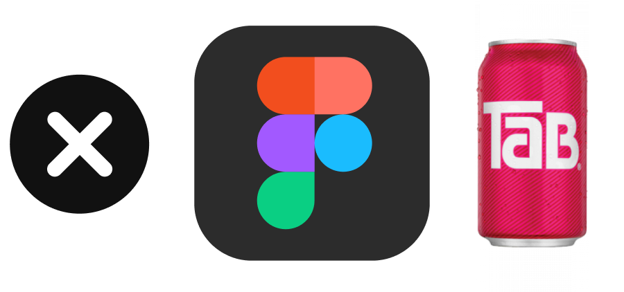

# Close Figma Tab - Chrome and Firefox extension

This extension, available for [Chrome](https://chrome.google.com/webstore/detail/close-figma-tab/oonojkdagfgjmempbfipokgjjigkoocj) and [Firefox](https://addons.mozilla.org/en-US/firefox/addon/close-figma-tab/) will automatically close your Chrome tab after the Figma file opens in the [Figma desktop app](https://www.figma.com/downloads/).

## Get the extension online:

- Get it [from the Chrome Web Store](https://chrome.google.com/webstore/detail/close-figma-tab/oonojkdagfgjmempbfipokgjjigkoocj)
- Or [from the Firefox Add-ons website](https://addons.mozilla.org/en-US/firefox/addon/close-figma-tab/)

## Install it manually in Chrome:

1. Download the [latest release](https://github.com/mamuso/close-figma-tab/releases/latest) of the extension and unzip it
2. Launch Chrome
3. Go to Extensions `chrome://extensions/`
4. Toggle `Developer mode`
5. Click `Load unpacked extension`
6. Select `src` folder inside the unzipped folder

## Something is broken?

Please, [file an issue](https://github.com/mamuso/close-figma-tab/issues) in the repository.